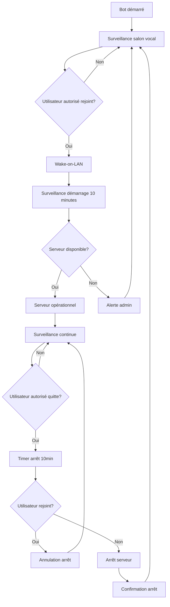

# 🔄 Workflow Complet - Bot CubeGuardian (Version Optimisée)

## 📋 **Vue d'ensemble du workflow**

Le bot surveille en permanence le salon vocal "L'écho-du-Cube" et déclenche des actions selon l'activité des utilisateurs autorisés. **Version optimisée avec workflows intelligents et arrêt propre.**

---

## 🎯 **États du système**

### **État 1 : Serveur arrêté (IDLE)**

- Serveur Proxmox : ⚫ Arrêté
- Serveur Minecraft : ⚫ Indisponible
- Salon vocal : 👥 Vide ou utilisateurs non autorisés
- Bot : 🔍 Surveillance passive

### **État 2 : Démarrage en cours (STARTUP_MONITORING)**

- Serveur Proxmox : 🟡 Démarrage (Wake-on-LAN envoyé)
- Serveur Minecraft : 🟡 En cours de démarrage
- Salon vocal : 👥 Utilisateur(s) autorisé(s) présent(s)
- Bot : ⏱️ Surveillance toutes les minutes (10 min max)

### **État 3 : Serveur opérationnel (SERVER_OPERATIONAL)**

- Serveur Proxmox : 🟢 Opérationnel
- Serveur Minecraft : 🟢 Disponible
- Salon vocal : 👥 Utilisateur(s) autorisé(s) présent(s)
- Bot : 🔍 Surveillance continue

### **État 4 : Timer d'arrêt (SHUTDOWN_TIMER)**

- Serveur Proxmox : 🟢 Opérationnel
- Serveur Minecraft : 🟢 Disponible
- Salon vocal : 👥 Vide (timer 10 min actif)
- Bot : ⏰ Compte à rebours avec interruption possible

### **État 5 : Arrêt en cours (SHUTDOWN_IN_PROGRESS)**

- Serveur Proxmox : 🟡 Arrêt propre (conteneurs LXC → nœud)
- Serveur Minecraft : 🟡 Fermeture
- Salon vocal : 👥 Vide
- Bot : 🔍 Surveillance arrêt (10 min max)

---

## 🔄 **Workflow détaillé (Version Optimisée)**

### **💬 COMMANDE DE REDÉMARRAGE MINECRAFT (Nouveau Workflow)**

#### **Étape 1 : Réception de la commande**

```
Utilisateur mentionne le bot ou envoie MP : "@CubeGuardian redémarrer le serveur minecraft"
    ↓
🔧 CONFIGURATION HYBRIDE (Nouveau) :
    ├─ 💬 Messages privés : Mode PERMISSIF (pas de mention requise)
    │   Exemple : "restart minecraft" → ACCEPTÉ
    └─ 🌐 Salons publics : Mode STRICT (mention obligatoire)
        Exemple : "restart minecraft" → REJETÉ (pas de mention)
        Exemple : "@bot restart minecraft" → ACCEPTÉ
    ↓
Analyse du message avec reconnaissance NLP française
    ↓
Détection mots-clés : ["redémarrer", "restart", "reboot", "serveur", "minecraft"]
    ↓
Si commande détectée → Étape 2 (Vérification utilisateur)
Si commande non reconnue → Message d'aide
```

#### **Étape 2 : Vérification permissions et sécurité**

```
Vérification utilisateur dans groupe "players"
    ↓
Si non autorisé → Message "🚫 Permission refusée"
    ↓
Si autorisé → Vérification cooldown (dernière commande > 10 min)
    ↓
Si cooldown actif → Message "⏳ Attendre [X] minutes"
    ↓
Si cooldown OK → Étape 3 (Demande de confirmation)
```

#### **Étape 3 : Demande de confirmation**

```
Message de confirmation : "⚠️ Redémarrer le serveur Minecraft ? (oui/non)"
    ↓
Attente réponse utilisateur (60 secondes)
    ↓
Si "oui" confirmé → Étape 4 (Exécution)
Si "non" ou timeout → Annulation "❌ Redémarrage annulé"
```

#### **Étape 4 : Exécution du redémarrage**

```
Message : "🔄 Redémarrage du serveur Minecraft en cours..."
    ↓
Log sécurisé : "Redémarrage Minecraft demandé par [utilisateur] à [timestamp]"
    ↓
Appel API REST Proxmox : POST /nodes/pve/lxc/105/status/reboot
    ↓
Si succès API → Étape 5 (Surveillance)
Si échec API → Message "❌ Erreur technique" + alerte admin
```

#### **Étape 5 : Surveillance du redémarrage**

```
Surveillance toutes les 30 secondes (5 minutes max)
    ↓
Test connectivité Minecraft (port 25565)
    ↓
Si Minecraft DOWN → Attendre (conteneur en cours de redémarrage)
    ↓
Si Minecraft UP → Étape 6 (Succès)
    ↓
Si timeout 5 minutes → Étape 7 (Échec)
```

#### **Étape 6 : Succès du redémarrage**

```
Calcul temps total de redémarrage
    ↓
Message : "✅ Serveur Minecraft redémarré en [X] secondes"
    ↓
Log : "Redémarrage Minecraft réussi en [X]s par [utilisateur]"
    ↓
Mise à jour cooldown utilisateur
```

#### **Étape 7 : Échec du redémarrage**

```
Message : "❌ Échec du redémarrage du serveur Minecraft"
    ↓
Alerte admin : "🚨 Échec redémarrage Minecraft - Utilisateur: [nom] - Timeout 5min"
    ↓
Log : "Échec redémarrage Minecraft par [utilisateur] - timeout"
```

---

## 🔄 **Workflow détaillé (Version Optimisée)**

### **🟢 DÉMARRAGE DU SERVEUR (Workflow Intelligent)**

#### **Étape 1 : Détection d'activité**

```
Utilisateur autorisé rejoint le salon vocal
    ↓
Vérification de l'identité dans la liste autorisée
    ↓
Si autorisé → Étape 2
Si non autorisé → Ignorer
```

#### **Étape 2 : Test immédiat Minecraft**

```
Test de connectivité Minecraft (port 25565)
    ↓
Si Minecraft UP → Étape 3 (Serveur déjà opérationnel)
Si Minecraft DOWN → Étape 4 (Démarrage nécessaire)
```

#### **Étape 3 : Serveur déjà opérationnel**

```
Message dans "Salon-du-Cube" : "🟢 Serveur déjà opérationnel ! Minecraft disponible"
    ↓
logging : "Minecraft déjà accessible - pas de démarrage nécessaire"
    ↓
Passage en mode surveillance continue (SERVER_OPERATIONAL)
```

#### **Étape 4 : Démarrage nécessaire**

```
Message dans "Salon-du-Cube" : "🟡 Démarrage du serveur demandé par [utilisateur]"
    ↓
Envoi du Magic Packet (Wake-on-LAN)
    ↓
logging : "Wake-on-LAN envoyé pour [utilisateur]"
    ↓
Passage en mode surveillance (STARTUP_MONITORING)
```

#### **Étape 5 : Surveillance intelligente (toutes les minutes)**

```
Attendre 1 minute
    ↓
Test de connectivité Proxmox (TCP port 8006)
    ↓
Si Proxmox DOWN → Retour surveillance (tentative suivante)
    ↓
Si Proxmox UP → Test Minecraft (port 25565)
    ↓
Si Minecraft UP → Étape 6 (Succès)
    ↓
Si Minecraft DOWN → Retour surveillance (tentative suivante)
    ↓
Répéter jusqu'à 10 tentatives (10 minutes max)
```

#### **Étape 6 : Succès du démarrage**

```
Message dans "Salon-du-Cube" : "🟢 Serveur opérationnel ! Minecraft disponible sur [IP]:[PORT]"
    ↓
logging : "Minecraft opérationnel après [X] minutes"
    ↓
Passage en mode surveillance continue (SERVER_OPERATIONAL)
```

#### **Étape 7 : Échec du démarrage (après 10 minutes)**

```
Message dans "Salon-du-Cube" : "❌ Serveur non disponible après 10 minutes"
    ↓
Message privé à l'admin : "❌ Échec du démarrage du serveur - Timeout"
    ↓
logging : "Échec du démarrage après 10 minutes"
    ↓
Passage en mode surveillance (IDLE)
```

---

### **🔴 ARRÊT DU SERVEUR (Workflow avec Arrêt Propre)**

#### **Étape 1 : Détection d'inactivité**

```
Dernier utilisateur autorisé quitte "L'écho-du-Cube"
    ↓
Vérification : Aucun utilisateur autorisé restant
    ↓
Démarrage du timer d'arrêt (10 minutes)
    ↓
Message dans "Salon-du-Cube" : "⏰ Aucun utilisateur autorisé. Arrêt dans 10 minutes..."
    ↓
logging : "Timer d'arrêt démarré - 10 minutes"
    ↓
Passage en mode SHUTDOWN_TIMER
```

#### **Étape 2 : Timer avec interruption possible**

```
Compte à rebours : 10 minutes
    ↓
Chaque minute : Vérification utilisateurs autorisés
    ↓
Si utilisateur autorisé rejoint → Étape 3 (Annulation)
    ↓
Si timer expire → Étape 4 (Arrêt)
    ↓
Messages de compte à rebours : "Arrêt dans [X] minutes..."
```

#### **Étape 3 : Annulation du timer**

```
Utilisateur autorisé rejoint pendant le timer
    ↓
Annulation immédiate du timer d'arrêt
    ↓
Message dans "Salon-du-Cube" : "✅ Arrêt annulé. Utilisateur autorisé détecté. Bienvenu [utilisateur]"
    ↓
logging : "Timer d'arrêt annulé par [utilisateur]"
    ↓
Passage en mode SERVER_OPERATIONAL
```

#### **Étape 4 : Arrêt propre du serveur**

```
Timer expiré (10 minutes)
    ↓
Message dans "Salon-du-Cube" : "🔴 Arrêt du serveur en cours..."
    ↓
logging : "Début de l'arrêt propre du serveur"
    ↓
Passage en mode SHUTDOWN_IN_PROGRESS
    ↓
Étape 4a : Arrêt des conteneurs LXC
    ↓
Étape 4b : Arrêt du nœud Proxmox
```

#### **Étape 4a : Arrêt des conteneurs LXC**

```
Lister tous les conteneurs LXC actifs
    ↓
Pour chaque conteneur :
    - Envoi commande shutdown (timeout 60s)
    - Attendre arrêt propre
    ↓
logging : "Conteneurs LXC arrêtés : [liste]"
    ↓
Attendre 30 secondes pour propagation
```

#### **Étape 4b : Arrêt du nœud Proxmox**

```
Envoi commande shutdown au nœud Proxmox
    ↓
API REST : POST /nodes/pve/status (command=shutdown)
    ↓
logging : "Commande d'arrêt du nœud envoyée"
    ↓
Démarrage surveillance arrêt (10 minutes max)
```

#### **Étape 5 : Surveillance de l'arrêt**

```
Surveillance toutes les minutes (10 minutes max)
    ↓
Test de connectivité Proxmox (TCP port 8006)
    ↓
Si Proxmox DOWN → Étape 6 (Succès)
    ↓
Si Proxmox UP → Retour surveillance
    ↓
Si timeout 10 minutes → Étape 7 (Échec)
```

#### **Étape 6 : Succès de l'arrêt**

```
Proxmox détecté comme arrêté
    ↓
Calcul du temps d'arrêt total
    ↓
Message dans "Salon-du-Cube" : "⚫ Serveur éteint en [X] secondes"
    ↓
logging : "Serveur arrêté avec succès en [X] secondes"
    ↓
Passage en mode IDLE
```

#### **Étape 7 : Échec de l'arrêt**

```
Timeout après 10 minutes de surveillance
    ↓
Message dans "Salon-du-Cube" : "❌ Échec de l'arrêt du serveur"
    ↓
Message privé à l'admin : "❌ Échec de l'arrêt du serveur - Timeout"
    ↓
logging : "Échec de l'arrêt après 10 minutes de surveillance"
    ↓
Passage en mode ERROR
```

---

## 🚨 **Gestion des cas d'erreur**

### **Erreur de connectivité**

```
Problème de réseau détecté
    ↓
Message d'alerte à l'admin
    ↓
Tentative de reconnexion (3 essais)
    ↓
Si échec → Mode maintenance
```

### **Erreur de script PowerShell**

```
Script wakeup-pve.ps1 échoue
    ↓
Log de l'erreur
    ↓
Message d'alerte à l'admin
    ↓
Tentative de relance (1 fois)
```

### **Erreur de permissions Discord**

```
Bot perd les permissions
    ↓
Message d'alerte à l'admin
    ↓
Arrêt du bot (sécurité)
```

---

## 📊 **Diagramme de flux**



---

## ⏱️ **Timers et délais (Version Optimisée)**

| Action                     | Délai       | Description                                    |
| -------------------------- | ----------- | ---------------------------------------------- |
| Test immédiat Minecraft    | Instantané  | Vérification avant démarrage                   |
| Surveillance démarrage     | 10 minutes  | Temps max pour que le serveur soit disponible  |
| Intervalle surveillance    | 1 minute    | Test Proxmox/Minecraft toutes les minutes      |
| Timer d'arrêt              | 10 minutes  | Délai avant arrêt automatique                  |
| Compte à rebours           | 1 minute    | Messages de compte à rebours                   |
| Arrêt conteneurs LXC       | 60 secondes | Timeout pour arrêt propre de chaque conteneur  |
| Propagation arrêt          | 30 secondes | Attente entre arrêt conteneurs et arrêt nœud   |
| Surveillance arrêt         | 10 minutes  | Temps max pour confirmer l'arrêt du serveur    |
| Test connectivité          | 10 secondes | Timeout pour tests TCP (Proxmox/Minecraft)     |
| Reconnexion                | 30 secondes | Intervalle entre tentatives de reconnexion     |
| **Commandes interactives** |             | **Nouveaux délais pour commandes**             |
| Cooldown commande          | 10 minutes  | Délai minimum entre commandes par utilisateur  |
| Confirmation utilisateur   | 60 secondes | Timeout pour confirmer redémarrage             |
| Surveillance redémarrage   | 5 minutes   | Temps max pour redémarrage conteneur LXC       |
| Test redémarrage           | 30 secondes | Intervalle tests Minecraft pendant redémarrage |

---

## 🔐 **Sécurité et permissions**

### **Utilisateurs autorisés**

- Liste configurée dans le fichier de configuration
- Vérification par ID Discord unique
- Possibilité d'ajouter/retirer des utilisateurs

### **Permissions du bot**

- Lecture des salons vocaux
- Écriture dans le salon textuel
- Envoi de messages privés à l'admin
- Exécution de scripts système (PowerShell)

### **Logs et audit**

- Tous les événements sont loggés
- Historique des actions dans Discord
- Fichiers de logs locaux pour debug

### **Sécurité des commandes (Nouveau)**

- **Configuration hybride canaux** :
  - 💬 **Messages privés** : Mode PERMISSIF (pas de mention requise)
  - 🌐 **Salons publics** : Mode STRICT (mention obligatoire)
- **Cooldown par utilisateur** : 1 commande/10min maximum
- **Demande de confirmation** : Validation explicite requise
- **Logs détaillés** : Utilisateur, timestamp, IP, résultat
- **Validation stricte** : Seuls les joueurs autorisés
- **Rate limiting** : Protection contre le spam de commandes

---

---

## 🆕 **Nouvelles fonctionnalités (Version Optimisée)**

### **✨ Améliorations du workflow de démarrage**

- **Test immédiat Minecraft** : Vérification avant tout démarrage
- **Surveillance intelligente** : Tests toutes les minutes au lieu de toutes les 10 secondes
- **Détection "déjà opérationnel"** : Évite les démarrages inutiles
- **Messages informatifs** : Compte à rebours et statut détaillé

### **✨ Améliorations du workflow d'arrêt**

- **Timer avec interruption** : Possibilité d'annuler l'arrêt
- **Arrêt propre des conteneurs** : Arrêt des LXC avant le nœud
- **Surveillance de l'arrêt** : Vérification que le serveur s'arrête bien
- **Messages de compte à rebours** : Information en temps réel

### **✨ Améliorations techniques**

- **API REST Proxmox** : Remplacement des scripts PowerShell par l'API
- **Tests TCP** : Remplacement du ping par des tests de ports
- **Gestion d'erreurs robuste** : Logs détaillés et récupération d'erreurs
- **Timeouts appropriés** : Délais optimisés pour chaque opération

### **✨ Commandes interactives (Version 2.1.0)**

- **Handler de messages** : Écoute mentions et messages privés
- **Reconnaissance NLP** : Analyse langage naturel français avec tolérance aux fautes
- **API LXC Proxmox** : Redémarrage direct conteneurs via /lxc/{id}/status/reboot
- **Système de sécurité** : Cooldown, confirmation, validation, logs détaillés
- **Expérience utilisateur** : Messages de feedback en temps réel

---

**Dernière mise à jour :** 2025-01-16  
**Version :** 2.1.0 (Commandes Interactives)  
**Validation technique :** ✅ Workflows optimisés validés, 🔄 Commandes interactives en cours
