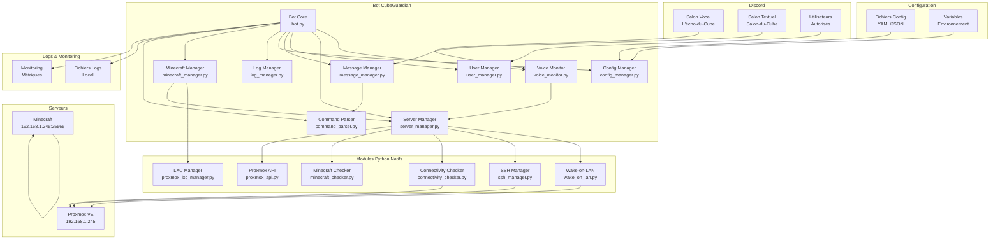
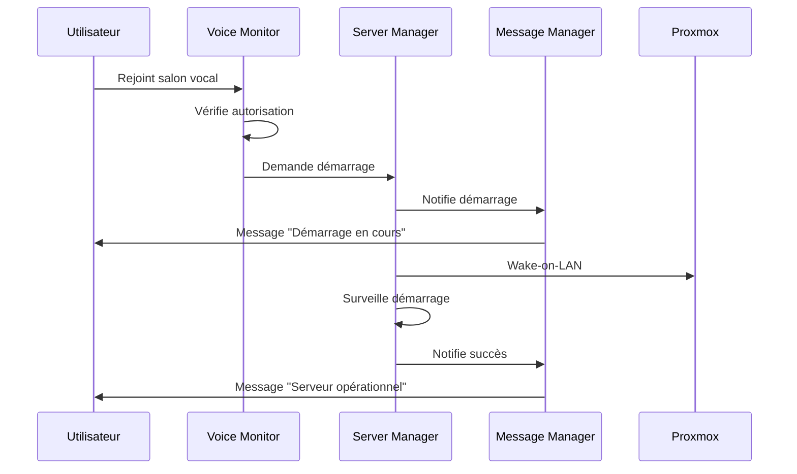
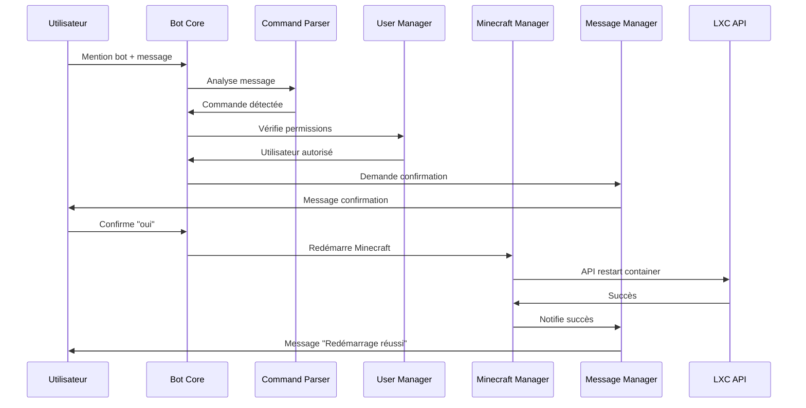
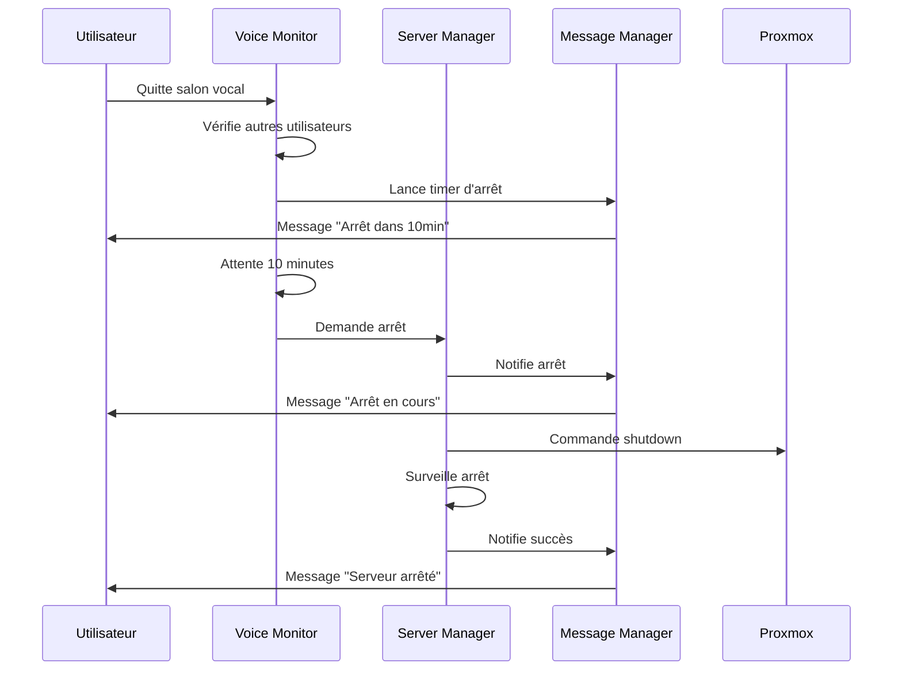

# 🏗️ Architecture - Bot CubeGuardian (Version Optimisée)

## 📋 **Vue d'ensemble architecturale**

Architecture complète du système Bot Discord CubeGuardian avec workflows optimisés, API REST Proxmox, modules Python natifs et commandes interactives.

> 🆕 **Version 2.1.0** : Architecture étendue avec commandes interactives, reconnaissance NLP française et API LXC Proxmox

---

## 🎯 **Architecture générale**

### **Diagramme d'architecture**



---

## 🧩 **Composants principaux**

### **1. Bot Core (`bot.py`)**

**Responsabilités :**

- Point d'entrée principal
- Orchestration des composants
- Gestion du cycle de vie
- Machine à états
- Handler de messages Discord (commandes)

**Interfaces :**

```python
class CubeGuardianBot:
    def __init__(self, config_path: str)
    async def start(self) -> None
    async def stop(self) -> None
    async def restart(self) -> None
    def get_state(self) -> BotState
    def set_state(self, state: BotState) -> bool
```

**Dépendances :**

- Voice Monitor
- Server Manager
- User Manager
- Message Manager
- Config Manager
- Log Manager

---

### **2. Voice Monitor (`voice_monitor.py`)**

**Responsabilités :**

- Surveillance des salons vocaux
- Détection des connexions/déconnexions
- Gestion des timers d'arrêt
- Vérification des utilisateurs autorisés

**Interfaces :**

```python
class VoiceMonitor:
    def __init__(self, bot, voice_channel_name: str)
    async def start_monitoring(self) -> None
    async def stop_monitoring(self) -> None
    async def on_voice_state_update(self, member, before, after) -> None
    async def check_authorized_users(self) -> int
    async def start_shutdown_timer(self, delay: int) -> None
    async def cancel_shutdown_timer(self) -> None
```

**Événements :**

- `on_user_join` : Utilisateur rejoint le salon
- `on_user_leave` : Utilisateur quitte le salon
- `on_timer_expired` : Timer d'arrêt expiré
- `on_timer_cancelled` : Timer d'arrêt annulé

---

### **3. Server Manager (`server_manager.py`)**

**Responsabilités :**

- Gestion des serveurs Proxmox et Minecraft
- Exécution des scripts PowerShell
- Surveillance de la disponibilité
- Gestion des erreurs de connectivité

**Interfaces :**

```python
class ServerManager:
    def __init__(self, server_config: dict)
    async def wake_server(self) -> bool
    async def shutdown_server(self) -> bool
    async def check_proxmox_status(self) -> bool
    async def check_minecraft_status(self) -> bool
     async def wait_for_startup(self, timeout: int = 600) -> bool  # 10 minutes par défaut
     async def wait_for_shutdown(self, timeout: int = 60) -> bool  # 1 minute par défaut
```

**Sous-composants :**

- `WakeOnLANManager` : Gestion Wake-on-LAN natif Python
- `SSHManager` : Gestion SSH et shutdown natif Python
- `ConnectivityChecker` : Tests de connectivité natif Python
- `MinecraftChecker` : Vérification Minecraft natif Python

---

### **4. User Manager (`user_manager.py`)**

**Responsabilités :**

- Gestion des utilisateurs autorisés
- Vérification des permissions
- Gestion des groupes d'utilisateurs
- Audit des accès

**Interfaces :**

```python
class UserManager:
    def __init__(self, user_config: dict)
    def is_authorized(self, user_id: int) -> bool
    def get_user_permissions(self, user_id: int) -> list
    def add_authorized_user(self, user_id: int, permissions: list) -> bool
    def remove_authorized_user(self, user_id: int) -> bool
    def get_authorized_users_present(self, voice_channel) -> list
```

**Données :**

- Liste des utilisateurs autorisés
- Permissions par utilisateur
- Groupes d'utilisateurs
- Historique des accès

---

### **5. Message Manager (`message_manager.py`)**

**Responsabilités :**

- Gestion des messages Discord
- Formatage des notifications
- Envoi des alertes admin
- Gestion des templates de messages

**Interfaces :**

```python
class MessageManager:
    def __init__(self, message_config: dict)
    async def send_startup_message(self, user: discord.Member) -> None
    async def send_shutdown_message(self, delay: int) -> None
    async def send_admin_alert(self, alert_type: str, details: dict) -> None
    async def send_status_message(self, status: str) -> None
    def format_message(self, template: str, variables: dict) -> str
```

**Types de messages :**

- Messages d'information
- Messages d'alerte
- Messages d'erreur
- Alertes admin (privées)

---

### **6. Config Manager (`config_manager.py`)**

**Responsabilités :**

- Chargement des configurations
- Validation des paramètres
- Gestion des variables d'environnement
- Rechargement à chaud

**Interfaces :**

```python
class ConfigManager:
    def __init__(self, config_path: str)
    def load_config(self) -> dict
    def validate_config(self) -> bool
    def get_config(self, key: str, default=None)
    def set_config(self, key: str, value) -> bool
    def reload_config(self) -> bool
```

**Fichiers gérés :**

- `bot.yaml` : Configuration principale
- `servers.yaml` : Configuration des serveurs
- `discord.yaml` : Configuration Discord
- `messages.yaml` : Messages du bot
- `users.yaml` : Utilisateurs autorisés

---

### **7. Log Manager (`log_manager.py`)**

**Responsabilités :**

- Gestion centralisée des logs
- Rotation des fichiers de logs
- Niveaux de log configurables
- Intégration avec Discord

**Interfaces :**

```python
class LogManager:
    def __init__(self, config: dict)
    def setup_logging(self) -> logging.Logger
    def log_info(self, message: str) -> None
    def log_warning(self, message: str) -> None
    def log_error(self, message: str) -> None
    def log_critical(self, message: str) -> None
```

**Types de logs :**

- Logs d'application
- Logs d'erreur
- Logs d'audit
- Logs de performance

### **8. Minecraft Manager (`minecraft_manager.py`) (Nouveau)**

**Responsabilités :**

- Gestion spécifique du serveur Minecraft
- Redémarrage via API LXC Proxmox
- Système de cooldown par utilisateur
- Surveillance des opérations de redémarrage

**Interfaces :**

```python
class MinecraftManager:
    def __init__(self, config: dict, server_manager, logger)
    async def restart_minecraft_server(self, user_id: int, container_id: int = 105) -> dict
    def check_user_cooldown(self, user_id: int) -> bool
    def update_user_cooldown(self, user_id: int) -> None
    async def wait_for_restart_completion(self, timeout: int = 300) -> bool
    async def get_restart_statistics(self) -> dict
```

### **9. Command Parser (`command_parser.py`) (Nouveau)**

**Responsabilités :**

- Reconnaissance des commandes en langage naturel français
- Tolérance aux fautes d'orthographe et anglicismes
- Analyse sémantique des messages
- Score de confiance pour les commandes

**Interfaces :**

```python
class CommandParser:
    def __init__(self)
    def detect_restart_command(self, message_content: str) -> bool
    def normalize_text(self, text: str) -> str
    def calculate_similarity_score(self, text: str, keywords: list) -> float
    def extract_command_intent(self, message: str) -> dict
    def get_help_response(self) -> str
```

---

## 🔄 **Flux de données**

### **Flux de démarrage**



### **Flux de commande redémarrage (Nouveau)**



### **Flux d'arrêt**



---

## 🗄️ **Modèle de données**

### **États du bot**

```python
from enum import Enum

class BotState(Enum):
    IDLE = "idle"                    # En attente
    STARTUP_REQUESTED = "startup"    # Démarrage demandé
    STARTUP_MONITORING = "monitoring" # Surveillance démarrage
    SERVER_OPERATIONAL = "operational" # Serveur opérationnel
    SHUTDOWN_TIMER = "shutdown_timer" # Timer d'arrêt actif
    SHUTDOWN_IN_PROGRESS = "shutdown" # Arrêt en cours
    ERROR = "error"                  # État d'erreur
    MAINTENANCE = "maintenance"      # Mode maintenance
```

### **Configuration des serveurs**

```python
@dataclass
class ServerConfig:
    name: str
    ipv4: str
    mac_address: str
    ssh_user: str
    ssh_key_path: str
    web_interface: str

@dataclass
class MinecraftConfig:
    name: str
    ipv4: str
    port: int
    timeout: int
    startup_delay: int
```

### **Utilisateur autorisé**

```python
@dataclass
class AuthorizedUser:
    user_id: int
    username: str
    display_name: str
    permissions: list
    added_date: datetime
    last_seen: datetime
```

---

## 🔧 **Intégrations externes**

### **Discord API**

**Endpoints utilisés :**

- `on_voice_state_update` : Surveillance des salons vocaux
- `on_member_join/remove` : Gestion des membres
- `send_message` : Envoi de messages
- `send_dm` : Messages privés

**Permissions requises :**

- `VIEW_CHANNEL` : Voir les salons
- `SEND_MESSAGES` : Envoyer des messages
- `CONNECT` : Se connecter aux salons vocaux
- `VIEW_CHANNEL` : Voir l'état des membres

### **Modules Python Natifs (Remplacement PowerShell)**

**Modules utilisés :**

- `wake_on_lan.py` : Wake-on-LAN natif Python
- `ssh_manager.py` : Gestion SSH et shutdown natif Python
- `connectivity_checker.py` : Vérification connectivité natif Python
- `minecraft_checker.py` : Vérification Minecraft natif Python

**Caractéristiques des modules Python :**

- **Performance native** : Pas d'overhead PowerShell
- **Retour JSON** : Format standardisé pour le bot
- **Gestion d'erreur** : Exception handling Python natif
- **Intégration directe** : Appels de fonctions Python

**Méthode d'exécution :**

```python
class ServerManager:
    """Gestionnaire de serveurs unifié - Version Python natif"""

    def __init__(self, config: dict, logger: logging.Logger):
        self.config = config
        self.logger = logger

        # Initialisation des sous-modules
        self.wake_on_lan = WakeOnLANManager(logger)
        self.ssh_manager = SSHManager(logger)
        self.connectivity_checker = ConnectivityChecker(logger)
        self.minecraft_checker = MinecraftChecker(logger)

    async def wake_server(self, mac_address: str, target_host: str) -> Dict[str, Any]:
        """Wake-on-LAN du serveur Proxmox"""
        return await self.wake_on_lan.wake_server(mac_address, target_host)

    async def shutdown_server(self, target_host: str, ssh_user: str, ssh_key_path: str) -> Dict[str, Any]:
        """Arrêt du serveur Proxmox"""
        return await self.ssh_manager.shutdown_server(target_host, ssh_user, ssh_key_path)
```

### **Serveurs cibles**

**Proxmox VE :**

- IP : 192.168.1.245
- MAC : 00:23:7D:FD:C0:5C
- Interface web : https://192.168.1.245:8006
- SSH : root@192.168.1.245

**Minecraft :**

- IP : 192.168.1.245
- Port : 25565
- Protocole : TCP
- Timeout : 5 secondes

---

## 🐳 **Architecture Docker**

### **Structure des conteneurs**

```yaml
version: "3.8"

services:
  cubeguardian:
    build: .
    container_name: cubeguardian-bot
    restart: unless-stopped
    environment:
      - DISCORD_BOT_TOKEN=${DISCORD_BOT_TOKEN}
      - BOT_DEBUG=false
    volumes:
      - ./config:/app/config:ro
      - ./logs:/app/logs
      - ./scripts:/app/scripts:ro
    networks:
      - bot-network
    depends_on:
      - redis

  redis:
    image: redis:7-alpine
    container_name: cubeguardian-redis
    restart: unless-stopped
    volumes:
      - redis-data:/data
    networks:
      - bot-network
```

### **Dockerfile**

```dockerfile
FROM python:3.11-slim

# Installation des dépendances système (Python natif uniquement)
RUN apt-get update && apt-get install -y \
    ping \
    && rm -rf /var/lib/apt/lists/*

# Création de l'utilisateur non-root
RUN useradd -m -u 1000 botuser

# Copie des fichiers
COPY requirements.txt /app/
COPY . /app/

# Installation des dépendances Python
RUN pip install --no-cache-dir -r requirements.txt

# Permissions
RUN chown -R botuser:botuser /app
USER botuser

# Répertoire de travail
WORKDIR /app

# Commande de démarrage
CMD ["python", "bot.py"]
```

---

## 📊 **Monitoring et observabilité**

### **Métriques collectées**

```python
@dataclass
class BotMetrics:
    startups_requested: int = 0
    startups_successful: int = 0
    shutdowns_requested: int = 0
    shutdowns_successful: int = 0
    errors_count: int = 0
    uptime_seconds: int = 0
    active_users: int = 0
    last_activity: datetime = None
```

### **Health checks**

```python
class HealthChecker:
    def __init__(self, bot):
        self.bot = bot

    async def check_health(self) -> dict:
        return {
            'bot_status': self.bot.get_state().value,
            'discord_connected': self.bot.discord_client.is_ready(),
            'proxmox_reachable': await self.bot.server_manager.check_proxmox_status(),
            'minecraft_reachable': await self.bot.server_manager.check_minecraft_status(),
            'memory_usage': psutil.Process().memory_info().rss,
            'uptime': time.time() - self.bot.start_time
        }
```

---

## 🔒 **Sécurité**

### **Isolation des composants**

- **Bot** : Conteneur Docker isolé
- **Scripts** : Exécution avec permissions limitées
- **Configuration** : Variables d'environnement sécurisées
- **Logs** : Pas de données sensibles

### **Gestion des secrets**

```python
import os
from dotenv import load_dotenv

class SecretManager:
    def __init__(self):
        load_dotenv()

    def get_discord_token(self) -> str:
        return os.getenv('DISCORD_BOT_TOKEN')

    def get_ssh_key_path(self) -> str:
        return os.getenv('SSH_KEY_PATH')
```

### **Validation des entrées**

```python
def validate_user_input(user_id: int) -> bool:
    """Valide l'ID utilisateur Discord"""
    return isinstance(user_id, int) and 100000000000000000 <= user_id <= 999999999999999999

def validate_ip_address(ip: str) -> bool:
    """Valide une adresse IP"""
    import ipaddress
    try:
        ipaddress.ip_address(ip)
        return True
    except ValueError:
        return False
```

### **Sécurité des commandes (Nouveau)**

```python
class CommandSecurityManager:
    """Gestionnaire de sécurité pour les commandes interactives"""

    def __init__(self):
        self.cooldowns = {}  # user_id -> timestamp
        self.failed_attempts = {}  # user_id -> count
        self.blocked_users = set()

    def check_cooldown(self, user_id: int) -> bool:
        """Vérifie le cooldown de 10 minutes par utilisateur"""
        last_command = self.cooldowns.get(user_id, 0)
        return (time.time() - last_command) >= 600  # 10 minutes

    def update_cooldown(self, user_id: int) -> None:
        """Met à jour le cooldown de l'utilisateur"""
        self.cooldowns[user_id] = time.time()

    def record_failed_attempt(self, user_id: int) -> bool:
        """Enregistre une tentative échouée, retourne True si spam détecté"""
        count = self.failed_attempts.get(user_id, 0) + 1
        self.failed_attempts[user_id] = count

        if count >= 5:  # 5 tentatives échouées
            self.blocked_users.add(user_id)
            return True
        return False

    def is_user_blocked(self, user_id: int) -> bool:
        """Vérifie si l'utilisateur est bloqué"""
        return user_id in self.blocked_users
```

**Mesures de sécurité implémentées :**

- ✅ **Cooldown par utilisateur** : 10 minutes entre commandes
- ✅ **Validation des permissions** : Seuls les joueurs autorisés
- ✅ **Demande de confirmation** : Validation explicite requise
- ✅ **Détection de spam** : Blocage après 5 tentatives échouées
- ✅ **Logs détaillés** : Traçabilité complète des actions
- ✅ **Rate limiting** : Protection contre les attaques par déni de service
- ✅ **Timeout de confirmation** : Annulation automatique après 60 secondes

---

## 🚀 **Déploiement**

### **Environnements**

1. **Développement** : Local avec Docker Compose
2. **Test** : Serveur de test avec données factices
3. **Production** : Serveur dédié avec monitoring

### **Pipeline de déploiement**

```yaml
# .github/workflows/deploy.yml
name: Deploy CubeGuardian

on:
  push:
    branches: [main]

jobs:
  deploy:
    runs-on: ubuntu-latest
    steps:
      - uses: actions/checkout@v3
      - name: Build Docker image
        run: docker build -t cubeguardian .
      - name: Deploy to server
        run: |
          docker-compose down
          docker-compose up -d
```

---

## 📋 **Checklist d'architecture**

### **Composants**

- [ ] Bot Core implémenté
- [ ] Voice Monitor fonctionnel
- [ ] Server Manager opérationnel
- [ ] User Manager configuré
- [ ] Message Manager intégré
- [ ] Config Manager validé
- [ ] Log Manager configuré

### **Intégrations**

- [ ] Discord API connectée
- [ ] Modules Python natifs intégrés
- [ ] Serveurs cibles accessibles
- [ ] Configuration validée

### **Sécurité**

- [ ] Secrets gérés sécuritairement
- [ ] Permissions minimales
- [ ] Validation des entrées
- [ ] Isolation des composants

### **Monitoring**

- [ ] Métriques collectées
- [ ] Health checks implémentés
- [ ] Logs centralisés
- [ ] Alertes configurées

---

**Dernière mise à jour :** 2025-01-16  
**Version :** 1.1.0  
**Validation technique :** ✅ Vérifié avec sources officielles
